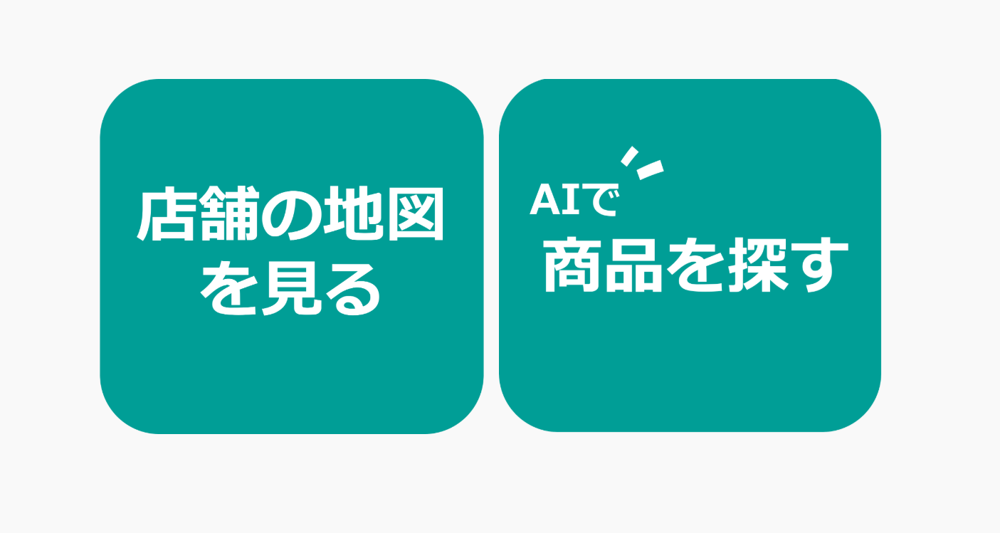
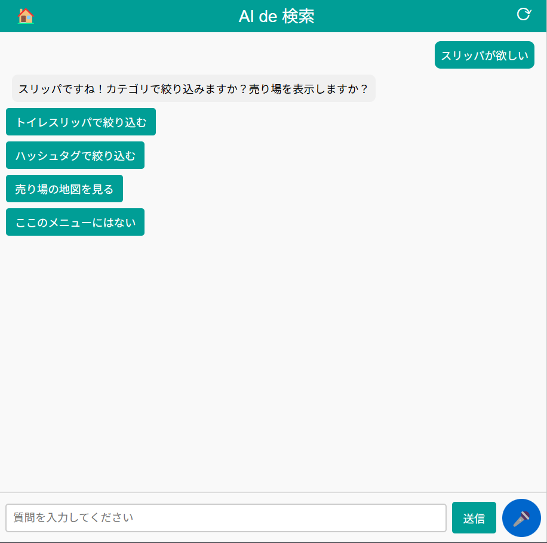
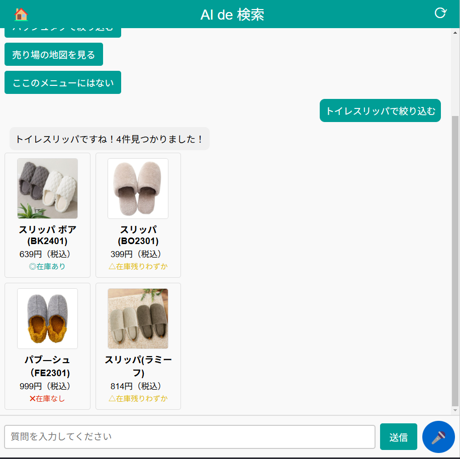
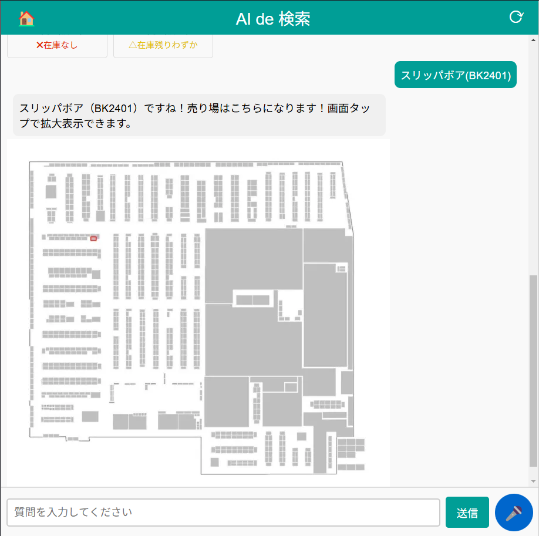
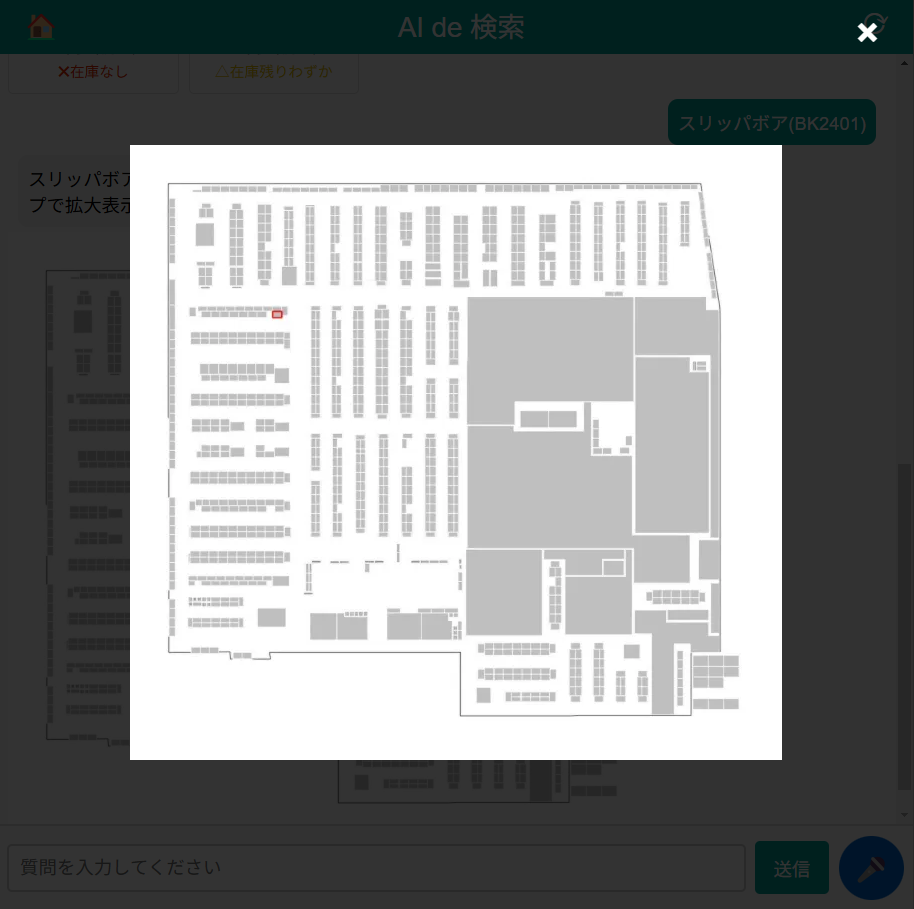

# ハッカソン成果物
## intoduction
株式会社ニトリ様主催の「CXハッカソン」というインターンシップ型の企画に参加しました。以下はその報告になります。


「CX」は、顧客体験（Customer Experience）を指し、CXハッカソンでは「店舗内における顧客体験向上を目指したWebアプリケーションの作成」をテーマとして与えられました。（ハッカソン開始前に、店舗へ赴き、顧客の購買行動などを観察し、課題の抽出を行った）

著者はリーダーとして、全体の進捗管理、方針決め、コード管理、FlaskのAPIの開発などを行いました。


---
## 課題

1. 現行のニトリの大型店舗では商品の探索への時間がかかり、商品探索の過程で蓄積される疲労による顧客体験の低下、それによる機会損失が問題になっている。

2. 1に対して、ニトリアプリでは「商品がどこの棚にあるか検索する機能」がすでにあるが、商品棚検索までに最高で15回の操作が必要であり、「ユーザの認知度がかなり低い」という現状があった。


## 提案

1. 以上の問題に対して、「ショッピングカートに『商品検索に特化したタブレット』搭載する」という提案を行った。

2. タブレットは取り付け、取り外しが任意で選択できる。店舗内の在庫管理システムをもとに、検索を行い、商品の位置をチャット風UIによって特定する。


## 誰をターゲットにして、誰をターゲットにしていないか

1. ニトリは博物館のような「見るのが楽しい」という側面があるため、少量の物品を買う人や、店舗内在留時間が少ない人にとっては、今回のソリューションは適合しない

2. 逆に、新生活などで大量の物品を一度に購入する人にとっては店内の滞留時間は多くなり、後半では疲労が溜まる。ので、今回のソリューションと相性が良い


## demo
初期画面



ボタンを押すと、チャットに遷移します。スリッパが欲しいと入力してみると、メニューが表示されます。



メニューをタップしていくと、商品の一覧が表示されます


商品をタップすると商品棚の位置が表示されます


（商品棚の写真は拡大することも可能です）


## 嬉しいこと
・検索に必要な工数の削減：15回の手順から5回の手順で商品棚の検索が可能になりました。

・音声による検索が可能。（こだわった所）カートを引きながら商品を探せます。画面に集中する時間を減らせる！

## Usage
```
# venv環境の作成
python -m venv venv

# venv環境の有効化(Windows)
.\venv\Script\activate

# パッケージのインストール
python -m pip install -r requirements.txt

# 実行
python -m app.main

```

## 詳細
著者が全体の統括のため、意見をまとめたり、戦略を決めたり、議事録を作成した時のドキュメントになります。最終的には革新アイデア賞みたいなのに受賞できました。嬉しい。

また、最終発表に使ったOHPは`document/OHP.pdf`にあります。


[議論議事録①（前提の共有）](https://www.notion.so/1500c4052d4580f28f7bfa2876a48d2f?pvs=4)

[議論議事録②（戦略決め）](https://www.notion.so/1520c4052d458035bd7dfa5111d02abb?pvs=4)

[議論議事録③（メンバーとの議論内容）](https://www.notion.so/1d20c4052d45803bad53da5b7fe1557d?pvs=4)
